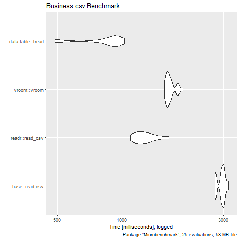
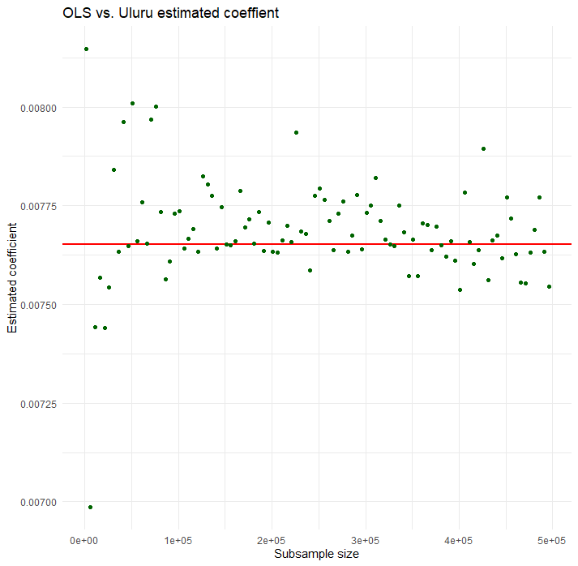
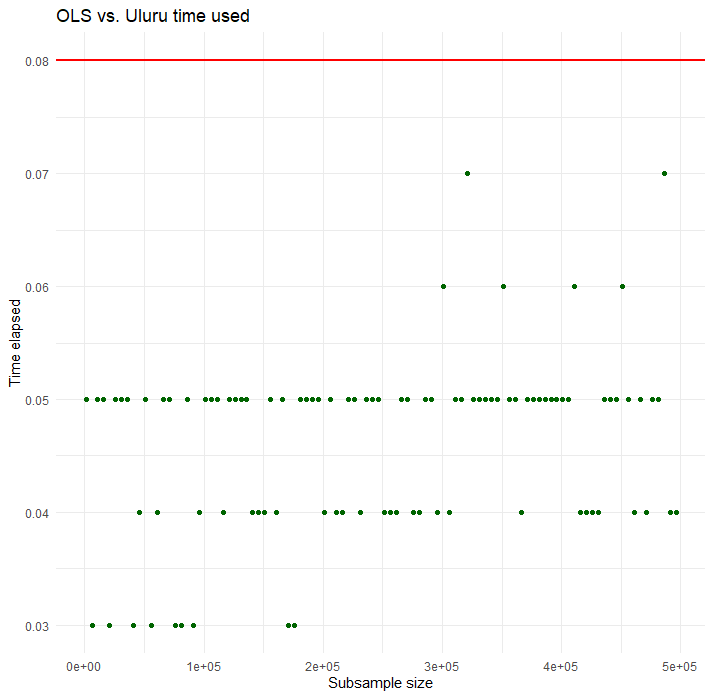

```{r set-options, echo=FALSE, cache=FALSE}
library(knitr)
```

## The Project

The Project we are about to present is an analysis of a YELP dataset that we found on kaggle.<br>
The basic idea is to conduct two different analysis:
<br>
<br>
- The probability of being an elite user <br>
<br>
We assume that people giving low star reviews will less likely be elite users.
For this we use a Uluru OLS method.
<br>
<br>
- The most important factors for good restaurant reviews
<br>
We try to predict the most important factors by using a forward selection method.


## Workflow

> - Getting the data
> - Analysis
> - Results

## Getting the data

> - Download the files
> - Problem 1: JSON unusable --> change into usable format


## R Code to convert JSON into csv


> - Vectorization of a function to make it faster:

> - *modifyObjects<-Vectorize(modifyObject, SIMPLIFY = F)*


> - Using the jsonlite::stream_in function:

> - *user<-stream_in(file('yelp_academic_dataset_user.json'), verbose = T)*


## Getting the data

- Download the files
- Change into usable format
- Filtering and cleaning


## Filtering and cleaning
Problem 2: The data was still too big

1. Use efficient functions
2. Filter out and clean variables


## Filtering and cleaning - using efficient functions

Benchmarking between different read in functions:

```{r, eval=FALSE}
results <- microbenchmark(
  'base::read.csv' = read.csv("CSVFiles/business.csv"),
  'readr::read_csv' = read_csv("CSVFiles/business.csv"),
  'vroom::vroom' = vroom("CSVFiles/business.csv"),
  'data.table::fread' = fread("CSVFiles/business.csv"),
  times = 25L
)
```


## Filtering and cleaning - using efficient functions
```{r, echo = FALSE, out.width = "55%", fig.align='center'}

```


## Filtering and cleaning - filter out and clean variables

1. business variables:

> - limited our variables to restaurant parent
> - filtered out closed restaurants
> - filtered out variables with >95% NA
> - Cleaning the character variables

> - **final data set with 81 usable Variables**

## Code
<!-- ech ha die code slides eifach mol inetoh, chöi mer aber guet wägloh -->
```{r, eval=FALSE}
busi <- 
  busi %>%
  filter(grepl("Restaurant", categories))
```

```{r, eval=FALSE}
busi <- 
  busi %>%
  filter(is_open==1)
```

```{r, eval=FALSE}
busi <- 
  busi %>%
  select(-attributes.AcceptsInsurance,
         -attributes.HairSpecializesIn.straightperms,
         -attributes.HairSpecializesIn.coloring,
         - 'and all other variables')
```

        

## Filtering and cleaning - filter out and clean variables

2. user variables:

> - only has 5 variables to begin with
> - filter out users with < 1 review
> - filter out non elite users
> - create variable for average useful mentions per review

> - **final data set with 2'189'457 observations**

## Code 

<!-- ech ha die code slides eifach mol inetoh, chöi mer aber guet wägloh -->

userNew<-user%>% <br>
**#only take users with at least one comment into consideration** <br>
  filter(review_count>=1)%>% <br>
**#create dummy if at some point, user is an elite user**<br>
  mutate(eliteDummy=ifelse(!is.na(elite),1,0))%>% <br>
  **#drop original elite column** select(-elite)%>%  <br>
**#create variable for average useful mentions per review** <br>
  mutate(usefulPerReview=useful/review_count)%>% <br>
  select(-useful)


## Analysis

1. The probabilty of being an elite user
2. Most important factors for good reviews

## Elite user Uluru OLS

```{r, eval=FALSE}
# Regression results
    `lm()`    Uluru   #all ***p<0.01
1 -0.0222  -0.0207    #eliteDummy
2  0.00765  0.00745   #average_stars
3  0.00752  0.00679   #usefulPerReview
4  0.00143  0.00142   #review_count
```

## Elite user Uluru OLS

```{r, echo = FALSE, out.width = "55%", fig.align='center'}

```

## Elite user Uluru OLS

```{r, echo = FALSE, out.width = "55%", fig.align='center'}

```

## Forward selection

```{r Overview, eval=FALSE, include=FALSE}
which(overview[1,]==TRUE)
```


```{r forward selection, eval=FALSE, include=FALSE}
ggplot(variableSelection, aes(x=x, y=y, label=label))+ 
  geom_line()+
  geom_point(data = variableSelection, aes(color=best))+
  geom_text(hjust=-0.1, color="red")+
  xlab("Number of Variables")+
  ylab("Adjusted R^2")+
  ggtitle("Change of adjusted R^2 when including more variables")+ 
  theme_bw()+
  scale_y_continuous(breaks=seq(0.94, 0.97, 0.001))+
  scale_color_manual(values=c("black", "red"))+
  theme(legend.position = "none")
```


## Results

