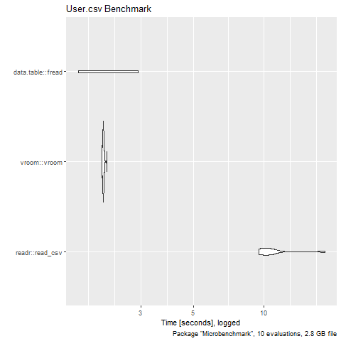

```{r set-options, cache=FALSE, include=FALSE}
library(knitr)
source("Analysis.R")
```

## The Project

The Project we are about to present is an analysis of a YELP dataset that we found on kaggle.<br>
The basic idea is to conduct two different analysis:
<br>
<br>
- The probability of being an elite user <br>
<br>
We assume that people giving low star reviews will less likely be elite users.
For this we use a Uluru OLS method.
<br>
<br>
- The most important factors for good restaurant reviews
<br>
We try to predict the most important factors by using a forward selection method.


## Workflow

> - Getting the data
> - Analysis
> - Results

## Getting the data

> - Download the files
> - *Problem 1: JSON unusable --> change into usable format*


## R Code to convert JSON into csv


- Vectorization function to process JSON strings:

```{r, eval=FALSE}
modifyObjects<-Vectorize(modifyObject, SIMPLIFY = F)
```


- Using the jsonlite::stream_in function:

```{r, eval=FALSE}
user<-stream_in(file('yelp_academic_dataset_user.json'), verbose = T)
```


## Getting the data

- Download the files
- Change into usable format
- *Filtering and cleaning*


## Filtering and cleaning
Problem 2: The data was still too big

1. Use efficient functions
2. Filter out and clean variables


## Using efficient functions

Benchmarking between different read in functions:

```{r, eval=FALSE}
results <- microbenchmark(
  'base::read.csv' = read.csv("CSVFiles/business.csv"),
  'readr::read_csv' = read_csv("CSVFiles/business.csv"),
  'vroom::vroom' = vroom("CSVFiles/business.csv"),
  'data.table::fread' = fread("CSVFiles/business.csv"),
  times = 25L
)
```


## Using efficient functions
```{r, echo = FALSE, out.width = "60%", fig.align='center'}
include_graphics("Graphics/business_microbenchmark.png")
```


## Using efficient functions
```{r, echo = FALSE, out.width = "60%", fig.align='center'}


```


## Filter out and clean variables

1. business variables:

> - limited our variables to restaurant parent
> - filtered out closed restaurants
> - filtered out variables with >95% NA
> - Cleaning the character variables

> - *final data set with 81 usable Variables*

        

## Filter out and clean variables

2. user variables:

> - to save RAM only used 5 variables to begin with
> - filter out users with < 1 review
> - filter out non elite users
> - create variable for average useful mentions per review

> - *final data set with 2'189'457 observations*

## Analysis

1. The probabilty of being an elite user
2. Most important factors for good reviews

## Elite user Uluru OLS

```{r, eval=FALSE}
# Regression results
    `lm()`    Uluru   #all ***p<0.01
1 -0.0222  -0.0207    #intercept (beta_0)
2  0.00765  0.00745   #average_stars
3  0.00752  0.00679   #usefulPerReview
4  0.00143  0.00142   #review_count
```

## Elite user Uluru OLS

```{r, echo = FALSE, out.width = "55%", fig.align='center'}
include_graphics("Graphics/ols_vs_uluru_coefficient_plot.png")
```

## Elite user Uluru OLS

```{r, echo = FALSE, out.width = "55%", fig.align='center'}

```

## Restaurant variables
1. Used all variables with less than 20'000 NAs
2. Lasso Approach
3. Forward selection

## Lasso Approach

```{r echo=TRUE}
lasso <- glmnet(as.matrix(df_ml[,c(2:44)]), df_ml$stars, alpha = 1) 
plot(lasso, xvar = "lambda", label = TRUE)
```

## Lasso Approach

This gives us the two variables that have the *largest beta* and therefore affect the ratings the most in absolute terms.

```{r echo=FALSE}
names(df_ml[,5])
names(df_ml[,23])
```


## Forward Selection

The Forward Selection shows us which variable explains the *variance* in the star rating the best.

```{r, echo=TRUE}

forward<-regsubsets(stars~.,data=df ,nvmax=50, method ="forward",
                    intercept = FALSE) #forward selection of variables
overview<-summary(forward)$which #logical matrix showing which variable
                                  #is in what forward model

which(overview[1,]==TRUE)
```

## Forward Selection

```{r forward selection, echo=FALSE}
ggplot(variableSelection, aes(x=x, y=y, label=label))+ 
  geom_line()+
  geom_point(data = variableSelection, aes(color=best))+
  geom_text(hjust=-0.1, color="red")+
  xlab("Number of Variables")+
  ylab("Adjusted R^2")+
  ggtitle("Change of adjusted R^2 when including more variables")+ 
  theme_bw()+
  scale_y_continuous(breaks=seq(0.94, 0.97, 0.001))+
  scale_color_manual(values=c("black", "red"))+
  theme(legend.position = "none")
```


## Results

1. Elite user hypothesis:<br>
    You are more likely to be an elite user when you give higher star ratings.<br> 
    1 and 5 Star ratings are on average the most useful ratings.
    
2. Influence on business rating:<br>
    Having a street parking and having a TV will result in the highest increase of a rating.<br>
    On the other hand, accepting credit cards explains most of the variance of the ratings.
